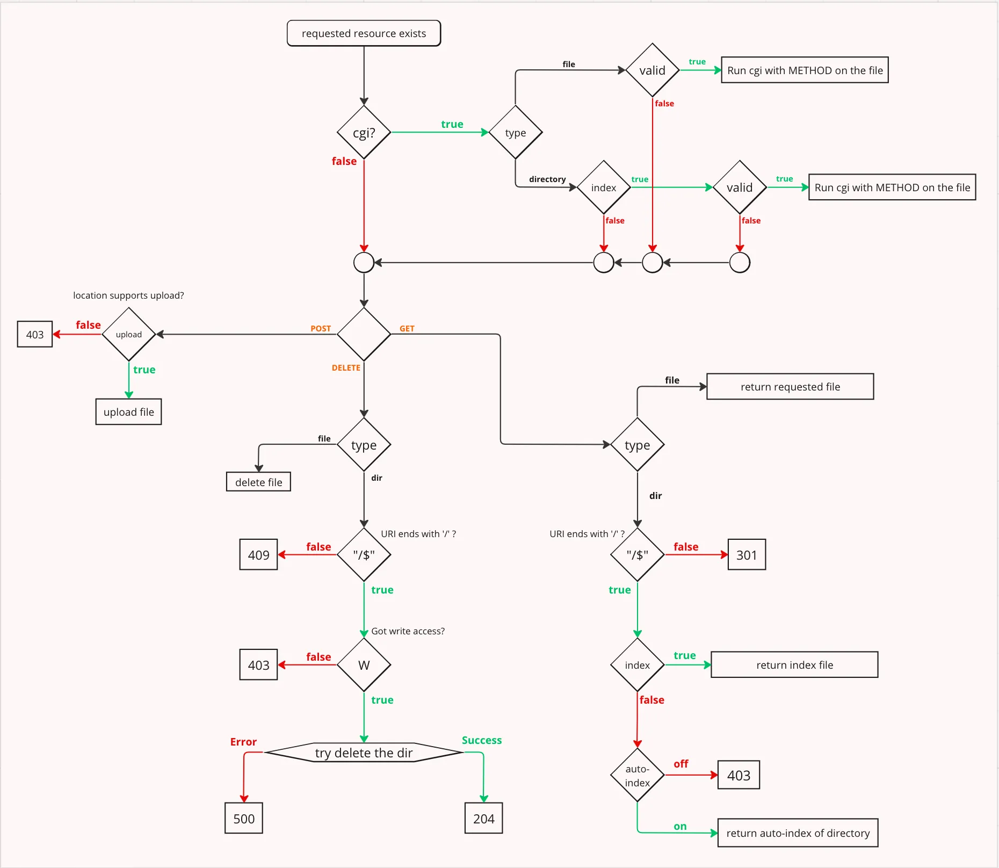

# webserv_1337

Here’s a **step-by-step roadmap** for the **Webserv project**, optimized for a **team of 3 developers**, with time estimates and parallel task assignments. This assumes prior C/C++ knowledge and basic networking familiarity.

---

### **Phase 1: Research & Setup (3–5 Days)**  
**Goal:** Understand requirements and set up the project skeleton.  
**Tasks:**  
1. **Study HTTP/1.1** (RFC 7230–7235) and **CGI** specs (split reading among team members).  
2. **Learn socket programming** (TCP, `bind()`, `listen()`, `accept()`).  
3. **Set up a Git repository** with a clear folder structure (e.g., `src/`, `config/`, `tests/`).  
4. **Choose tools**: Testing tools (`curl`, `telnet`), build system (Makefile/CMake), and debugging tools (`valgrind`, `GDB`).  
5. **Divide roles**:  
   - **Developer A**: Core server setup (sockets, event loop).  
   - **Developer B**: HTTP parsing logic.  
   - **Developer C**: Configuration file parser.  

---

### **Phase 2: Basic HTTP Server (1–2 Weeks)**  
**Goal:** Create a server that listens on a port and responds to simple requests.  
**Tasks:**  
1. **Socket setup** (Developer A):  
   - Create a socket, bind to a port, and listen for connections.  
   - Handle single-client `GET` requests (e.g., respond with "Hello World").  
2. **Event loop** (Developer A):  
   - Implement `select()`/`poll()`/`epoll()` to handle multiple clients.  
3. **HTTP request parsing** (Developer B):  
   - Parse headers (method, URI, `Host`, `Content-Length`).  
   - Handle malformed requests (return 400 Bad Request).  
4. **Response generation** (Developer B):  
   - Send basic HTTP responses (e.g., 200 OK, 404 Not Found).  

---

### **Phase 3: Static File Serving (1 Week)**  
**Goal:** Serve static files (HTML, images) from a directory.  
**Tasks:**  
1. **File I/O** (Developer C):  
   - Read files from disk and send them as HTTP responses.  
   - Handle MIME types (e.g., `Content-Type: text/html`).  
2. **Directory listing** (optional):  
   - Auto-generate HTML directory listings if no `index.html` exists.  
3. **Error pages** (Developer B):  
   - Custom 404, 403, and 500 pages.  

---

### **Phase 4: Configuration File (1 Week)**  
**Goal:** Parse a config file to define server behavior (similar to Nginx).  
**Tasks (Developer C)**:  
1. **Config syntax**: Support directives like `server`, `listen`, `location`, `error_page`, and `client_max_body_size`.  
2. **Validation**: Handle syntax errors in the config file.  
3. **Integration**: Apply config rules (e.g., routing, client size limits) to the server.  

---

### **Phase 5: CGI Support (1–2 Weeks)**  
**Goal:** Execute scripts (Python, PHP) to generate dynamic content.  
**Tasks (Developer A + B)**:  
1. **CGI setup**:  
   - Fork/exec scripts and pass environment variables (`PATH_INFO`, `QUERY_STRING`).  
2. **Pipe communication**:  
   - Send request body to the script via stdin.  
   - Capture stdout and send it as the HTTP response.  
3. **Testing**:  
   - Test with simple scripts (e.g., a Python script echoing query parameters).  

---

### **Phase 6: Concurrency & Optimization (2 Weeks)**  
**Goal:** Handle high traffic efficiently.  
**Tasks (Developer A + B)**:  
1. **Multiplexing**: Optimize the event loop (switch to `epoll` if using Linux).  
2. **Non-blocking I/O**: Ensure sockets don’t block during reads/writes.  
3. **Stress testing**: Use `ab` (Apache Bench) to simulate 100+ concurrent requests.  

---

### **Phase 7: Error Handling & Edge Cases (1 Week)**  
**Goal:** Ensure robustness.  
**Tasks (Entire Team)**:  
1. **Error recovery**: Handle broken pipes, timeouts, and invalid requests.  
2. **Memory leaks**: Run `valgrind` to detect and fix leaks.  
3. **Edge cases**:  
   - Large file uploads (test with `client_max_body_size`).  
   - Chunked transfer encoding (optional).  

---

### **Phase 8: Testing & Refinement (1 Week)**  
**Tasks (Entire Team)**:  
1. **Write unit tests**: Use a framework like Catch2 (optional).  
2. **Browser testing**: Check rendering of HTML/CSS/JS.  
3. **Cross-platform checks**: Ensure compatibility (macOS/Linux).  

---

### **Phase 9: Bonus Features (1–2 Weeks)**  
**Optional Extensions** (divide based on interest):  
1. **Keep-Alive connections** (HTTP persistent connections).  
2. **Redirection** (301, 302 status codes).  
3. **File uploads** via `POST`.  
4. **Logging** (access/error logs).  
5. **Authentication** (Basic Auth).  

---

### **Time Breakdown**  
- **Total Estimated Time**: 8–10 weeks (part-time, ~20 hours/week/person).  
- **Parallel Work**:  
  - **Phase 2–3**: Developer A (server setup) and B (HTTP parsing) can work in parallel.  
  - **Phase 4**: Developer C (config parser) can work alongside Phase 2/3.  
  - **Phase 5–6**: Team collaboration for CGI and concurrency.  

---

### **Team Collaboration Tips**  
1. **Daily syncs**: 15-minute standups to track progress.  
2. **Modular code**: Agree on interfaces (e.g., between HTTP parser and server).  
3. **Testing early**: Integrate components frequently.  
4. **Documentation**: Keep notes on design decisions and RFC compliance.  

---

### **Critical Success Factors**  
- **Strict adherence to RFCs**: Use [RFC 7230](https://tools.ietf.org/html/rfc7230) as your bible.  
- **Modularity**: Separate parsing, server, and CGI logic.  
- **Testing**: Test every feature with `curl` as you build (e.g., `curl -v http://localhost:8080`).  

By following this roadmap, a team of 3 can build a robust HTTP server in 2–3 months. Adjust timelines based on skill level, but focus on incremental progress and frequent integration.